## Intel GPU Community Issue Tracker (IGCIT)

**IGCIT** is a Community-driven issue tracker for Intel GPUs.

All the issues here will be reported directly to Intel.

We collect issues for **Windows only**, everything else, like Linux must be reported to the respective developers.
We also collect issues from **emulator developers**, if you find a bug in Intel **Windows drivers**, you can report it here.

You can report Mesa issues [here](https://gitlab.freedesktop.org/mesa/mesa).

### IGCIT Wiki
You can find links to latest _Intel driver_ and _release notes_ [here](https://github.com/IGCIT/Intel-GPU-Community-Issue-Tracker-IGCIT/wiki).

## How to report a bug

The following information are needed to help Intel to identify and fix the issue more quickly:

**If you want to report a bug in a Windows game**:

* Affected game
* CPU (_example: i7-1065G7_)
* Drivers build
* Rendering API (_DirectX, OpenGL, Vulkan_)
* Rendering API version (_example: DirectX 12_)
* Windows build
* Description
* Steps to reproduce
* Screenshot (_optional_)

**If you are a emulator developer**:

* Emulator name
* CPU or GPU (_example: i7-1065G7_)
* Drivers build
* Rendering API (_DirectX, OpenGL, Vulkan_)
* Rendering API version (_example: DirectX 12_)
* Description
* Steps to reproduce
* Screenshot (_optional_)
* Sample code / affected code (_optional_)
* Executable to reproduce the bug (_optional_)

Once you have collected all the required information, open a new issue describing your problem:

**You have a GitHub account _[Method 1]_**

 Open a new issue [here](https://github.com/IGCIT/Intel-GPU-Community-Issue-Tracker-IGCIT/issues).
 
 **You don't have a GitHub account _[Method 2]_**
 
 Submit a new issue [here](https://gitreports.com/issue/IGCIT/Intel-GPU-Community-Issue-Tracker-IGCIT).
 
 _You do **not** need a GitHub account or any other account for this._
 
 _Just remember to follow IGCIT template that we provide in that page._

# Help

## IGCIT Helper

This is a small utility to easily get your _**Windows build**_, _**CPU name**_ and _**GPU driver**_ version.

Download latest release [here](https://github.com/IGCIT/Intel-GPU-Community-Issue-Tracker-IGCIT/releases/latest).

## IGCIT Driver Switch

A tool to switch your _**Intel GPU driver**_ on the fly, based on Ciphray switch_driver.bat.

Its aim is to help to identify regressions quickly and easily.

See more in [IGCIT Wiki](https://github.com/IGCIT/Intel-GPU-Community-Issue-Tracker-IGCIT/wiki)

Download latest release [here](https://github.com/IGCIT/Intel-GPU-Community-Issue-Tracker-IGCIT/releases/latest).

## How to get Windows build number

* Right click _**Windows start button**_

* Open _**Settings**_

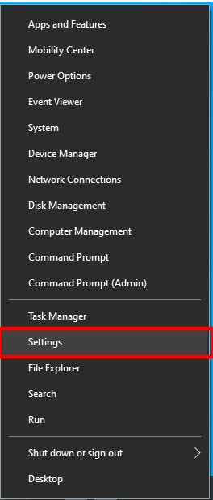

* Open _**System**_ settings

* Scroll down to _**About**_ and select it

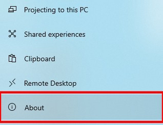

* Get your _Windows **Version**_ and _**OS Build**_ from here

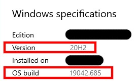

## How to get GPU driver build number

##### DxDiag _[Method 1]_

* Right click _**Windows start button**_

* Open _**Run**_

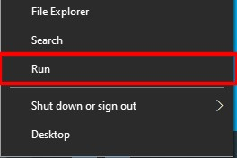

* Type _**dxdiag**_ and click _**OK**_

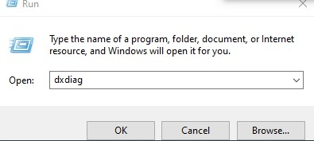

* Press _**Yes**_ if asked
* Navigate to _**Display**_ tab

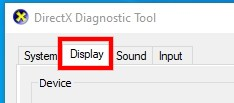

* Get your GPU driver _**Version**_ from here

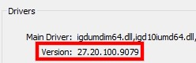

##### Intel Graphics Command Center _[Method 2]_

* Open the _**Intel Graphics Command Center**_

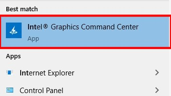

* Click _**System**_

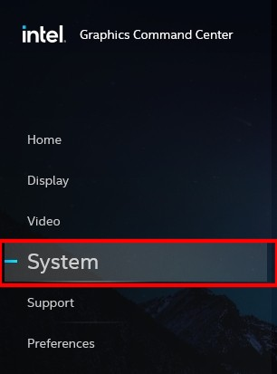

* Navigate to _**GPUs**_ tab

* Get your GPU _**Graphics Driver**_ version from here

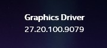

## How to get CPU name

* Right click _**Windows start button**_

* Open _**Settings**_

* Open _**System**_ settings

* Scroll down to _**About**_ and select it

* Get your _**Processor**_ name from here

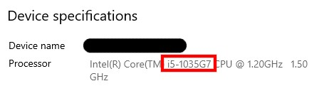

## How to get in-game screenshots

_**Please remember to hide or cut any sensible data from your screenshots!**_

Some games or launchers may have a screenshot feature.

What we describe here, is a game independent way of taking a screenshot.

This is probably the easiest way, and it is supposed to work for everything.

#### 1. Disable Windows 10 screenshot shortcut

Windows screenshot app is not always reliable, so let's disable it!

* Right click _**Windows start button**_

* Open _**Settings**_

* Open _**Ease of Access**_ settings

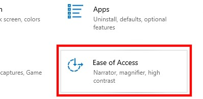

* Scroll down to _**Keyboard**_ and select it

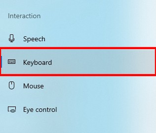

* Scroll down to _**Print Screen shortcut**_ and disable it

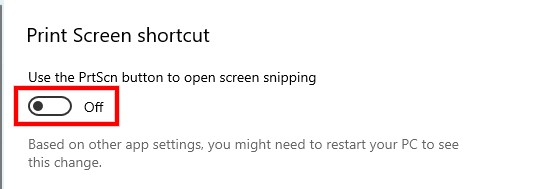

#### 2. Install [Lightshot](https://app.prntscr.com/en/index.html)

This small utility will let you take a screenshot quickly and easily.

* Download the Windows setup [here](https://app.prntscr.com/build/setup-lightshot.exe)
* Run _Lightshot_ setup
* Follow on-screen instructions and complete the installation

You should now have a new icon in your _System tray_.

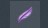

* Right click on _**Lightshot**_ icon
* Open _Lightshot_ _**Options**_

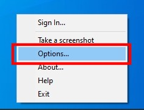

* Set your options as follows:

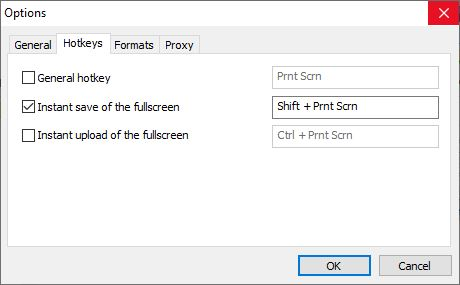

Windows screenshot shortcut will now run _Lightshot_.

# FAQs

> **Q**: How can I help?
>
> **A**: Test games and find issues!

> **Q**: Should I update my issue if it has been fixed by a driver update?
>
> **A**: Yes, if we do not close the issue, please let us know it has been fixed!

## Credits

* A big thanks to _**BenjaminLSR**_ for reporting issues to Intel!
* Zach Schneider: Git Reports developer.
* Ciphray: switch_driver.bat code.
